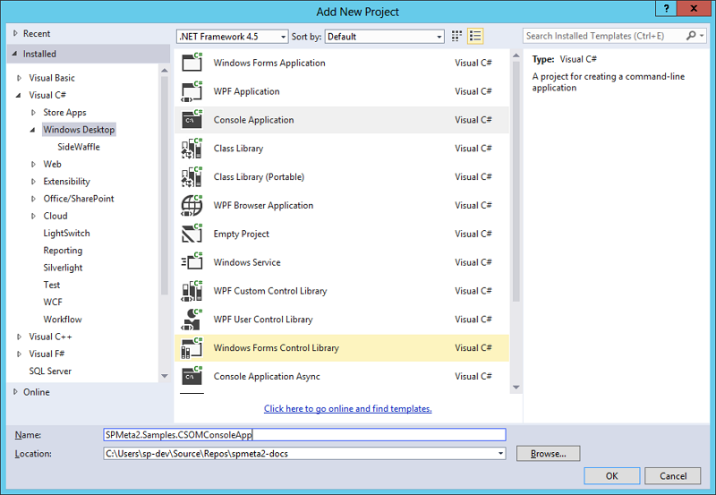

---
Title: Writing a console app
Order: 1120
---

# Writing a simple console app

SPMeta2 supports SharePoint 2010, SharePoint 2013 and SharePoint Online. 
We use NuGet to deliver all the packages, handle versioning, updates and patches. 

This article introduces a NuGet packages description, consuming NuGet packages in your applications and usage of github repository if you like to built SPMeta2 library from scratch.

### Referencing SPMeta2 from NuGet

The easiest way to start with SPMeta library is to use NuGet packages. We support a range of SharePoint versions - 2010, 2013 and Online as well as CSOM/SSOM, so we have a bunch of the NuGet packages out there.

#### The core library

* [SPMeta2.Core](https://www.nuget.org/packages/SPMeta2.Core/) - contains the core of the library and definitions for SharePoint Foundation

#### CSOM provision

CSOM provision (built with SharePoint 2013 onprem v15 assemblies):

* [SPMeta2.CSOM.Foundation](https://www.nuget.org/packages/SPMeta2.CSOM.Foundation/) - includes CSOM provision implementation for SharePoint Foundation 2013
* [SPMeta2.CSOM.Standard](https://www.nuget.org/packages/SPMeta2.CSOM.Standard/) - includes CSOM provision implementation for SharePoint Standard 2013

CSOM provision for SharePoint Online (built with SharePoint Online v16 assemblies):

* [SPMeta2.CSOM.Foundation-v16/](https://www.nuget.org/packages/SPMeta2.CSOM.Foundation-v16/) - includes CSOM provision implementation for SharePoint Online
* [SPMeta2.CSOM.Standard-v16](https://www.nuget.org/packages/SPMeta2.CSOM.Standard-v16/) - includes CSOM provision implementation for SharePoint Online

#### SSOM provision

SSOM provision for SharePoint 2013 (built with SharePoint 2013 assemblies):

* [SPMeta2.SSOM.Foundation](https://www.nuget.org/packages/SPMeta2.CSOM.Foundation/) - includes SSOM provision implementation for SharePoint Foundation 2013
* [SPMeta2.SSOM.Standard](https://www.nuget.org/packages/SPMeta2.CSOM.Standard/) - includes SSOM provision implementation for SharePoint Standard 2013

SSOM provision for SharePoint 2010 (built with SharePoint 2010 assemblies):

* [SPMeta2.SSOM.Foundation-v14](https://www.nuget.org/packages/SPMeta2.SSOM.Foundation-v14/) - includes SSOM provision implementation for SharePoint Foundation 2010
* [SPMeta2.SSOM.Standard-v14](https://www.nuget.org/packages/SPMeta2.SSOM.Standard-v14/) - includes SSOM provision implementation for SharePoint Standard 2010

### Building SPMeta2 from the source code
The other options you might consider is to use SPMeta2 github repository and built the library from scratch. Although it is not a recommended options, but still possible one.

Here are a few links to get started:

* [SPMeta2 library @ GITHUB](https://github.com/SubPointSolutions/spmeta2)
* [HTTPS clone URL - https://github.com/SubPointSolutions/spmeta2.git](https://github.com/SubPointSolutions/spmeta2.git)

One you have SPMeta2 solutions up and running, you can either build it with Visual Studio 2013 or use "build.ps1" script located in /SPMeta2/SPMeta2.Build folder.

### Creating a simple CSOM application for SharePoint 2013

Let's get started and create a simple console application which provisions a few fields and a content type on a target SharePoint site.

As we target SharePoint 2013, we would need to use [SPMeta2.CSOM.Foundation](https://www.nuget.org/packages/SPMeta2.CSOM.Foundation/) package.
Here are detailed steps to get startes:

#### Step 1, bootstrap a console application project
Start your Visual Studio and bootstrap a simple console application:

#### Step 2, use NuGet to get [SPMeta2.CSOM.Foundation](https://www.nuget.org/packages/SPMeta2.CSOM.Foundation/) package.
Simple use NuGet package manager to find and install [SPMeta2.CSOM.Foundation](https://www.nuget.org/packages/SPMeta2.CSOM.Foundation/) package or use the following command in the "Package Manager Console":

* install-package SPMeta2.CSOM.Foundation

#### Step 3, setup your definitions, model and provision service
There are a few outtanding things we need to complete - create definitions, setup relationships between them and, finally, push the model to the SharePoint site.

Include the following code in your console application changing the 'siteUrl', run it and enjoy the outcome.

### Creating a simple SSOM application for SharePoint 2013
Essentially, we would need to bootstrap the same console application (check previous CSOM application) and add [SPMeta2.SSOM.Foundation](https://www.nuget.org/packages/SPMeta2.SSOM.Foundation/) package or use the following command in the "Package Manager Console":

* install-package SPMeta2.SSOM.Foundation 

The actual code will be the same, but to enable SSOM based provision we need to use 'CSOMProvisionService'. Include the following code in your console application changing the 'siteUrl', run it and enjoy the outcome.

